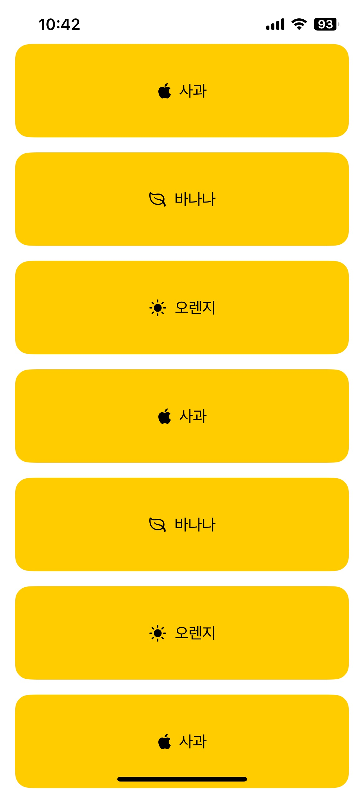

# iOS 스터디

SwiftUI 실습 프로젝트와 실험을 모아 둔 저장소입니다.

## 시작하기

1. 이 저장소를 클론합니다.
2. 원하는 `.xcodeproj` 파일을 Xcode에서 엽니다.
3. iOS 시뮬레이터나 실제 기기에서 빌드 및 실행합니다.

## 프로젝트 목록

| 폴더 | 설명 |
| --- | --- |
| 1Text&Stack | `Text` 뷰와 스택 레이아웃 기본 |
| 2Image | SwiftUI에서 이미지 다루기 |
| 3Spacing&Padding | 간격과 패딩 제어 |
| 4Button&State&TextField | 버튼, 상태, 텍스트 필드 사용 |
| 5ForEach&LazyVStack | `ForEach`와 Lazy Stack으로 동적 목록 |
| 6Navigation | 네비게이션 스택과 링크 |
| 7SafeArea | 세이프 에어리어 처리 |
| 8StateManagement | 상태 관리 패턴 |
| Calculator | 간단한 계산기 앱 |
| Clazzi | 인증과 투표 기능을 포함한 프로토타입 |
| Clazzi2 | Clazzi UI의 업데이트 버전 |
| ClazziFirebase | Firebase를 사용한 Clazzi 실험 |
| FlipFlick_iOS | 미디어 탐색 데모 |
| InstagramClone | Instagram 기능을 간단히 구현한 클론 |
| Landmark | Apple의 Landmark 튜토리얼 변형 |
| MVVMStudy | MVVM 아키텍처 기초 |
| MVVMStudy2 | 확장된 MVVM 예제 |
| MVVM&SwiftDataStudy | MVVM과 SwiftData 실험 |
| SwiftDataStudy | SwiftData 연습 프로젝트 |
| Practice01 | 다양한 SwiftUI 연습 |
| Practice2 | 추가 연습용 작은 앱 |
| Settings | 재사용 가능한 설정 화면 패턴 |

## 스크린샷

